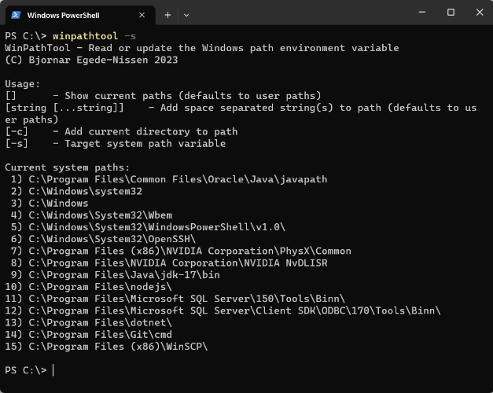

# Windows Path Tool

Copyright (C) Bjornar Egede-Nissen 2023
License: MIT

---

Command line tool for quickly adding/removing paths from the Windows path variable.

Correctly handles environment variables (e.g. `%appdata`) and paths longer than 256 characters.

Add any directory to the path by running `winpathtool -c` (-c for current).

